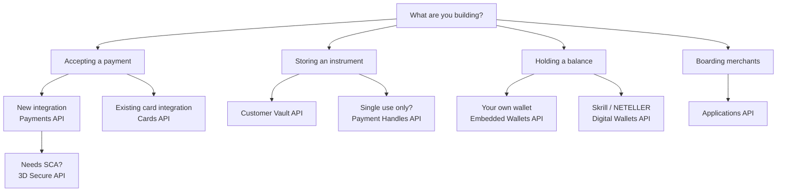

# APIs & SDKs

Every Paysafe API is REST over HTTPS, authenticated with HTTP Basic, and speaks JSON in both directions. The reference pages below are generated directly from our OpenAPI specifications, so they cannot drift from the API.


**Try it as you read.** Every endpoint page has a live request panel — fill in your test credentials and send a real call to the sandbox without leaving the docs.


## Start here

<table data-view="cards"><thead><tr><th></th><th></th><th data-hidden data-card-target data-type="content-ref"></th></tr></thead><tbody><tr><td><strong>Quickstart</strong></td><td>An approved payment in ten minutes.</td><td><a href="getting-started/quickstart.md">Quickstart</a></td></tr><tr><td><strong>Authentication</strong></td><td>Keys, Basic auth and key rotation.</td><td><a href="getting-started/authentication.md">Authentication</a></td></tr><tr><td><strong>Conventions</strong></td><td>Idempotency, pagination, amounts and timestamps.</td><td><a href="getting-started/conventions.md">API conventions</a></td></tr><tr><td><strong>Errors and retries</strong></td><td>Error shape, retry-safety and decline handling.</td><td><a href="getting-started/errors-and-retries.md">Errors and retries</a></td></tr></tbody></table>

## The APIs

| API | Endpoints | Use it for |
|---|---|---|
| [Payments](payments-api/) | 38 | The primary API. Payments, settlements, refunds, credits, orders, webhooks. |
| [Embedded Wallets](embedded-wallets-api/) | 30 | Wallets, balances, deposits, withdrawals, transfers, KYC. |
| [Cards](cards-api/) | 29 | The legacy card-processing interface. Supported, but not for new builds. |
| [Customer Vault](customer-vault-api/) | 27 | Stored profiles, cards, bank accounts and addresses. |
| [Applications](applications-api/) | 25 | Merchant onboarding, underwriting and sub-merchant management. |
| [Digital Wallets](digital-wallets-api/) | 21 | Skrill and NETELLER acceptance, payouts, Crypto On-Ramp. |
| [3D Secure](threeds-api/) | 16 | EMV 3-D Secure 2.x authentication and PSD2 exemptions. |
| [Payment Handles](payment-handles-api/) | 14 | Single-use instrument tokens and payment method discovery. |
| **Total** | **200** | |

## Which API for which job

## SDKs

You do not have to call the REST API directly. Official libraries handle authentication, retries, pagination and typed models.

<table data-view="cards"><thead><tr><th></th><th></th><th data-hidden data-card-target data-type="content-ref"></th></tr></thead><tbody><tr><td><strong>Server-side</strong></td><td>Java · PHP · Node.js · Python · .NET</td><td><a href="sdks/server-side-sdks.md">Server-side SDKs</a></td></tr><tr><td><strong>Mobile</strong></td><td>Android · iOS · React Native</td><td><a href="sdks/mobile-sdks.md">Mobile SDKs</a></td></tr><tr><td><strong>Paysafe JS</strong></td><td>Iframed payment fields for your own form</td><td><a href="sdks/paysafe-js.md">Paysafe JS</a></td></tr><tr><td><strong>Paysafe Checkout</strong></td><td>A hosted, themeable checkout</td><td><a href="sdks/paysafe-checkout.md">Paysafe Checkout</a></td></tr></tbody></table>


**Specs are published from CI.** Each reference above is generated from a spec in `specs/` in our docs repository. A merge that changes a spec republishes the reference automatically — see the [changelog](https://app.gitbook.com/s/XSPACE_CHANGELOG/) for what shipped.

