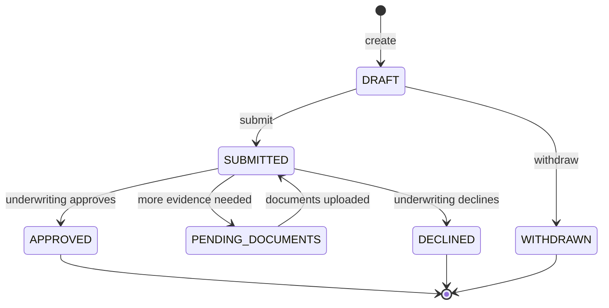

# Applications API

**Base path** `/applications/v1` · **25 endpoints**

If you board merchants of your own — a marketplace, a platform, a payment facilitator — this API submits their applications for underwriting and manages the resulting sub-merchant accounts.

## An application

An application collects four things before it can be submitted:

| Resource | What underwriting needs |
|---|---|
| **Application** | Processing volumes, average ticket, MCC, expected methods |
| **Business** | Legal entity, registration number, address, website |
| **Owners** | Beneficial owners above the disclosure threshold, with ID |
| **Documents** | Incorporation papers, bank statements, proof of identity |

## States

Every transition fires a webhook. Poll only as a fallback.

## Screen before you board


Run a **termination inquiry** before submitting. It screens the business and its owners against Mastercard MATCH Pro and the Visa Terminated Merchant File. Boarding a listed merchant exposes your own portfolio to scheme action.


## Bulk submission

Platforms migrating an existing book can submit applications in batches rather than one call at a time. Each application in a batch is underwritten independently — a decline on one does not affect the rest.


Underwriting turnaround depends on the risk profile and the completeness of the documents. Build your UI to show a pending state for days, not seconds, and drive it from webhooks.

