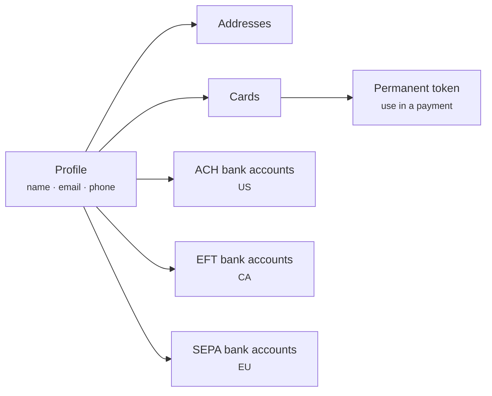

# Customer Vault API

**Base path** `/customervault/v1` · **27 endpoints**

The vault stores customer profiles and their payment instruments so that repeat purchases, subscriptions and payouts never require the customer to re-enter details — and never require you to store them.

## Structure

A profile can hold many instruments. Each instrument has a permanent token you pass to the Payments API in place of a payment handle.

## Single-use to permanent

Card data reaches the vault the same way it reaches a payment — through a token created client-side, never through your server.



### Capture client-side

Paysafe JS or Checkout captures the card and returns a **single-use token**. Valid for 15 minutes, usable once.



### Exchange server-side

Post the single-use token to the vault. You get back a permanent card token tied to a profile.



### Charge whenever

Use the permanent token in any later payment. The card number was never on your infrastructure.



## Credentials on file

Storing a card creates obligations under scheme rules. You must:

* **Disclose** at the time of storage how the card will be used, and get the cardholder's agreement.
* **Flag** each later transaction as merchant-initiated or customer-initiated.
* **Stop** charging when the customer withdraws consent.


Correct credentials-on-file flagging is not paperwork — issuers decline unflagged recurring transactions at materially higher rates, and mis-flagged transactions lose their chargeback protection.


## Deleting a profile

Deleting a profile removes its instruments. Transactions already made against it are unaffected and remain available for reporting, refunds and disputes.
