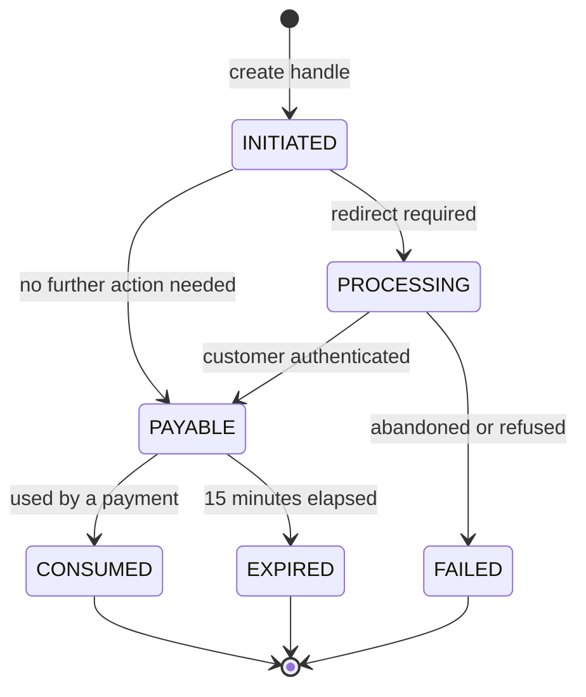

# Payment Handles API

**Base path** `/paymenthub/v1` · **14 endpoints**

A **payment handle** is a single-use token standing in for whatever instrument the customer chose — a card, a bank account, a wallet. It is the reason your servers never need to see a card number.

## Why handles exist


{% column width="50%" %}
### Without handles

Card data flows through your servers. Your PCI scope is **SAQ D**: quarterly scans, annual assessment, and a breach that is your problem.


{% column width="50%" %}
### With handles

Paysafe JS or Checkout captures the card in an iframe Paysafe controls. Your server only ever sees a token. Scope drops to **SAQ A**.



## Lifecycle


A handle is valid for **15 minutes** and can be consumed **once**. If a customer sits on your confirmation page too long, the handle expires and you must create a new one — build the retry into your checkout rather than surfacing an error.


## Methods that need a redirect

Cards usually go straight to `PAYABLE`. Bank transfers and wallets need the customer to authenticate off-site first: read the redirect URL from the handle, send the customer there, and call the complete endpoint when they return.

| Method | Redirect | Typical time |
|---|---|---|
| Card (no SCA) | No | Immediate |
| Card (3-D Secure) | Yes | 10–60 seconds |
| iDEAL, EPS, BLIK | Yes | 30–120 seconds |
| PayPal, Skrill, NETELLER | Yes | 20–90 seconds |
| ACH, EFT | No | Immediate to create |

## Simulations

In the test environment, a **simulation** forces a specific status or decline code on your next transaction — the way to exercise error paths that no test card produces.
