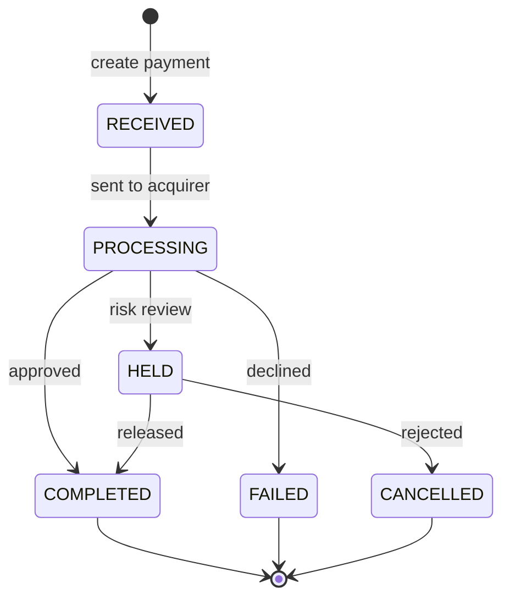

# Payments API

**Base path** `/paymenthub/v1` · **38 endpoints** · [Download the spec](https://app.gitbook.com/s/XSPACE_APIS/payments-api/)

The Payments API is the single integration point for every payment method Paysafe supports — cards, bank transfers, digital wallets and cash vouchers. It replaces the older [Cards API](../cards-api/) for new integrations.

## The model

| Resource | What it is |
|---|---|
| **Payment** | Money moving from a customer to you |
| **Settlement** | Capture of a previously authorized payment |
| **Refund** | Money returned against a settlement |
| **Standalone credit** | Money sent to a customer with no prior payment |
| **Verification** | A zero-dollar check that an instrument is valid |
| **Order** | A container for one or more payments against a basket |
| **Webhook** | Your endpoint, subscribed to lifecycle events |

## Lifecycle



`COMPLETED`, `FAILED` and `CANCELLED` are terminal. Everything else can still change — do not release goods until you see a terminal status.

## Auth-and-settle vs sale



```json
{ "settleWithAuth": true }
```
Authorize and capture together. Right for digital goods and anything delivered immediately.



```json
{ "settleWithAuth": false }
```
Hold funds now, capture on dispatch with `POST /payments/{id}/settle`. Authorizations typically expire after **7 days** — capture before then or the hold is released.



## Common tasks

<table data-view="cards"><thead><tr><th></th><th></th><th data-hidden data-card-target data-type="content-ref"></th></tr></thead><tbody><tr><td><strong>Take a payment</strong></td><td>The ten-minute path from credentials to an approval.</td><td><a href="../getting-started/quickstart.md">Quickstart</a></td></tr><tr><td><strong>Tokenize an instrument</strong></td><td>Create the payment handle that a payment consumes.</td><td><a href="../payment-handles-api/">Payment Handles API</a></td></tr><tr><td><strong>React to events</strong></td><td>Subscribe to webhooks rather than polling.</td><td><a href="https://app.gitbook.com/s/XSPACE_SUPPORT/tutorials/handling-webhooks.md">Handling webhooks</a></td></tr><tr><td><strong>Bill on a schedule</strong></td><td>Store a card and charge it again later.</td><td><a href="https://app.gitbook.com/s/XSPACE_SUPPORT/tutorials/recurring-payments.md">Recurring payments</a></td></tr></tbody></table>


Every endpoint page below is generated from `paysafe-payments-v1` and carries a live request panel. Fill in test credentials and send a real sandbox call without leaving this page.

