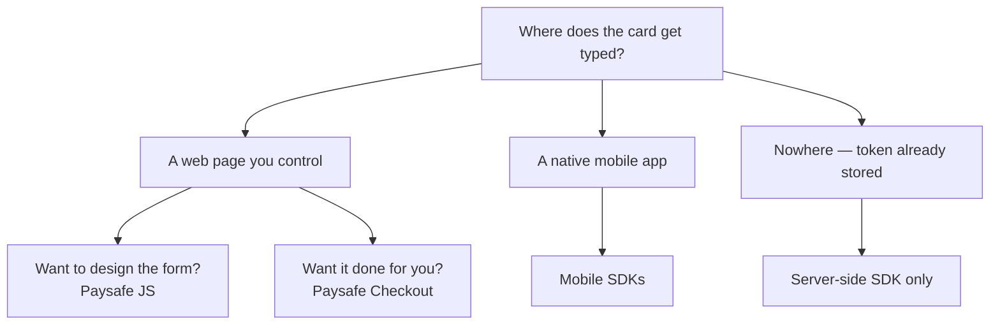

# All SDKs

You can call the REST APIs directly, but the official libraries handle authentication, retries, pagination and typed models for you — and they are generated from the same OpenAPI specs as this documentation, so they never drift.

## Client-side

Anything that touches card data belongs here, not on your server. These libraries capture the instrument inside a context Paysafe controls and hand your server a token.

<table data-view="cards"><thead><tr><th></th><th></th><th data-hidden data-card-target data-type="content-ref"></th></tr></thead><tbody><tr><td><strong>Paysafe JS</strong></td><td>Iframed payment fields you lay out inside your own form. SAQ A.</td><td><a href="paysafe-js.md">Paysafe JS</a></td></tr><tr><td><strong>Paysafe Checkout</strong></td><td>A complete hosted checkout, themeable to your brand.</td><td><a href="paysafe-checkout.md">Paysafe Checkout</a></td></tr><tr><td><strong>Mobile SDKs</strong></td><td>Android, iOS and React Native.</td><td><a href="mobile-sdks.md">Mobile SDKs</a></td></tr><tr><td><strong>Embedded Wallets SDK</strong></td><td>Pre-built wallet surfaces for web and mobile.</td><td><a href="embedded-wallets-sdk.md">Embedded Wallets SDK</a></td></tr></tbody></table>

## Server-side

<table data-view="cards"><thead><tr><th></th><th></th><th data-hidden data-card-target data-type="content-ref"></th></tr></thead><tbody><tr><td><strong>Java</strong></td><td>2.0.0 · Java 11+</td><td><a href="server-side-sdks.md">Server-side SDKs</a></td></tr><tr><td><strong>PHP</strong></td><td>3.2.0 · PHP 8.1+</td><td><a href="server-side-sdks.md">Server-side SDKs</a></td></tr><tr><td><strong>Node.js</strong></td><td>4.1.0 · Node 18+</td><td><a href="server-side-sdks.md">Server-side SDKs</a></td></tr><tr><td><strong>Python</strong></td><td>2.4.0 · Python 3.9+</td><td><a href="server-side-sdks.md">Server-side SDKs</a></td></tr><tr><td><strong>.NET</strong></td><td>3.0.0 · .NET 6+</td><td><a href="server-side-sdks.md">Server-side SDKs</a></td></tr></tbody></table>


**Never put a server-side SDK in a mobile app or a browser bundle.** Server SDKs authenticate with the API secret, which authorizes money movement. Anything shipped to a device can be extracted from it.


## Choosing

