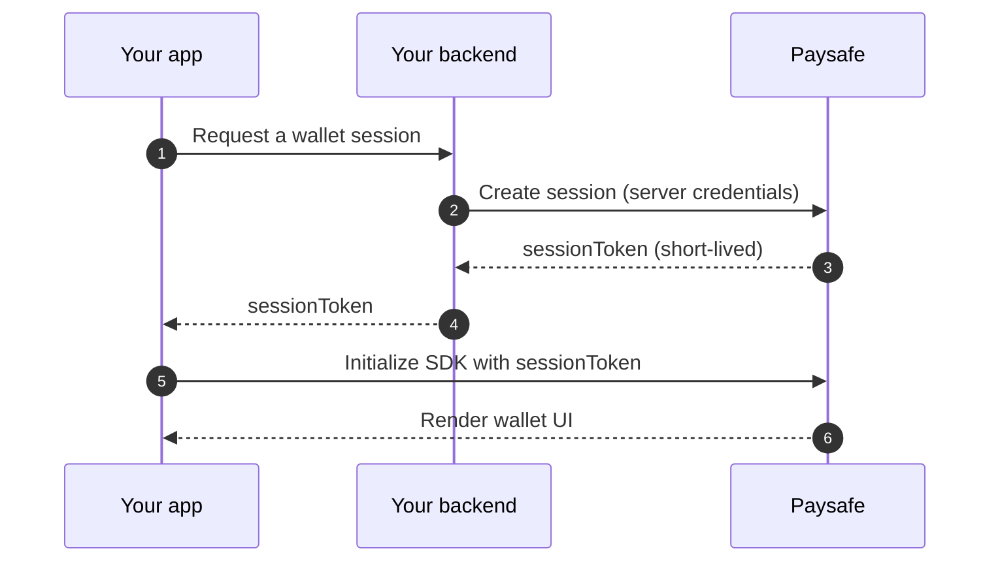

# Embedded Wallets SDK

The Embedded Wallets SDK renders the wallet screens your customers need — balance, deposit, withdraw, transaction history — inside your own application, so you do not build them from scratch.

| SDK | Version | Requires |
|---|---|---|
| Web | 3.0.1 | Any modern browser |
| Android | 2.2.0 | API 24+ |
| iOS | 2.2.0 | iOS 14+ |

## How it works




The session token is minted **on your backend** with your API secret and is scoped to one wallet. The SDK never sees your credentials, and a leaked session token exposes exactly one customer's wallet for a few minutes.


## Web

```html
<script src="https://hosted.paysafe.com/wallets/v3/paysafe.wallets.min.js"></script>
<div id="paysafe-wallet"></div>
```

```javascript
const wallet = await paysafe.wallets.mount("#paysafe-wallet", {
  sessionToken,
  environment: "TEST",
  locale: "en_US",
  screens: ["balance", "deposit", "withdraw", "history"],
  theme: {
    primaryColor: "#5A28FF",
    backgroundColor: "#FFFFFF",
    fontFamily: "Inter, system-ui, sans-serif",
    borderRadius: 8,
  },
});

wallet.on("depositCompleted", ({ amount, currencyCode }) => {
  refreshBalance(amount, currencyCode);
});

wallet.on("kycRequired", ({ tier }) => {
  showKycPrompt(tier);
});
```

## Events

| Event | Fires when |
|---|---|
| `ready` | The wallet UI has rendered |
| `depositCompleted` | A deposit reached a terminal success |
| `withdrawalRequested` | A withdrawal was submitted |
| `kycRequired` | An action needs a higher verification tier |
| `sessionExpired` | The session token expired — mint a new one |
| `error` | An unrecoverable error occurred |


Handle `sessionExpired`. Session tokens are deliberately short-lived; an app that does not refresh them shows customers a dead wallet after a few minutes idle.


## Version support

| Version | Status | Supported until |
|---|---|---|
| 3.x | Current | — |
| 2.x | Maintenance | 31 December 2026 |
| 1.x | End of life | Ended 30 June 2026 |

Use of the SDK is governed by the Paysafe SDK License Agreement.
