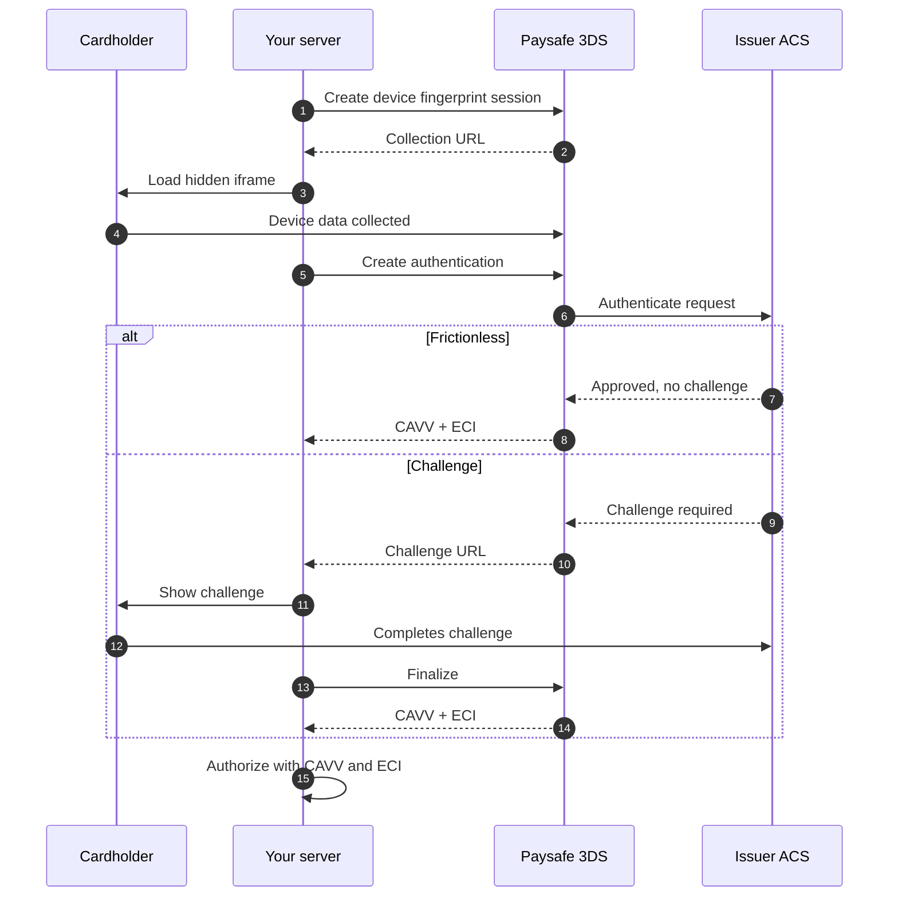

# 3D Secure API

**Base path** `/threedsecure/v2` · **16 endpoints**

3-D Secure authenticates the cardholder with their issuer before you authorize. Done properly it shifts liability for fraudulent chargebacks to the issuer, and it is mandatory for most consumer card payments in the EEA and UK under PSD2.

## The flow


Most authentications are **frictionless** — the issuer decides from the device and transaction data alone and the customer sees nothing. Collecting device data properly is what keeps that rate high.


## Liability shift by ECI

| ECI | Brand | Meaning | Liability |
|---|---|---|---|
| `05` | Visa | Fully authenticated | Issuer |
| `06` | Visa | Attempted | Issuer |
| `07` | Visa | Not authenticated | **You** |
| `02` | Mastercard | Fully authenticated | Issuer |
| `01` | Mastercard | Attempted | Issuer |
| `00` | Mastercard | Not authenticated | **You** |


Authorizing on ECI `07` or `00` is legal but leaves fraud liability with you. Decide deliberately whether the extra conversion is worth the chargeback exposure.


## Exemptions

PSD2 allows strong customer authentication to be skipped in defined cases. Requesting an exemption is a request, not a right — the issuer can refuse and demand a challenge.

| Exemption | Applies when |
|---|---|
| Low value | Under €30, with cumulative counters |
| Transaction risk analysis | Your acquirer's fraud rate is below the threshold |
| Trusted beneficiary | The cardholder allowlisted you at their bank |
| Recurring | Fixed amount, fixed schedule, after an authenticated first payment |
| Merchant-initiated | No cardholder present |
