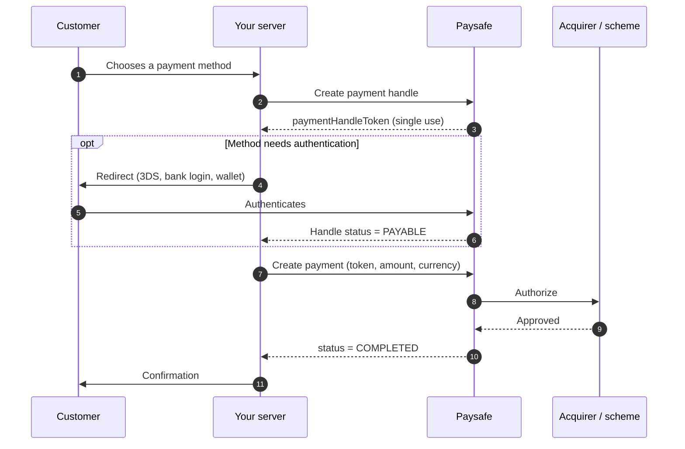

# Payments

Paysafe processes card payments, local bank transfers, digital wallets and cash vouchers through one API. You integrate once; enabling a new payment method afterwards is a configuration change, not a code change.

## How a payment works

Every payment follows the same three-step shape, whichever method the customer picks.



The payment handle is the important idea: it is a **single-use token** standing in for whatever instrument the customer chose. Your server never sees a card number, so your PCI scope stays small and the same code path handles a Visa card and an iDEAL bank transfer.

## Capture models



Authorize now, capture later. Use this when you ship goods after the order.

```json
{ "settleWithAuth": false }
```

Funds are held on the customer's card, then captured with a separate call to `POST /payments/{id}/settle`. Authorizations typically expire after 7 days.



Authorize and capture in one call. Use this for digital goods and anything delivered immediately.

```json
{ "settleWithAuth": true }
```

This is the default in most SDKs and the right choice unless you have a reason to split the two.



Capture less than you authorized — a shipped subset of a basket, for example.

```json
{ "amount": 2499 }
```

Send the partial amount on the settle call. The remaining authorization is released automatically.



## What to read next

<table data-view="cards"><thead><tr><th></th><th></th><th data-hidden data-card-target data-type="content-ref"></th></tr></thead><tbody><tr><td><strong>Quickstart</strong></td><td>A working payment in ten minutes.</td><td><a href="https://app.gitbook.com/s/YjnAGVmcGiEiZme2Neu4/getting-started/quickstart">Quickstart</a></td></tr><tr><td><strong>Payments API reference</strong></td><td>All 38 endpoints, with request and response schemas.</td><td><a href="https://app.gitbook.com/s/YjnAGVmcGiEiZme2Neu4/payments-api/">Payments API</a></td></tr><tr><td><strong>Payment handles</strong></td><td>How tokenization works and when handles expire.</td><td><a href="https://app.gitbook.com/s/YjnAGVmcGiEiZme2Neu4/payment-handles-api/">Payment Handles API</a></td></tr></tbody></table>
